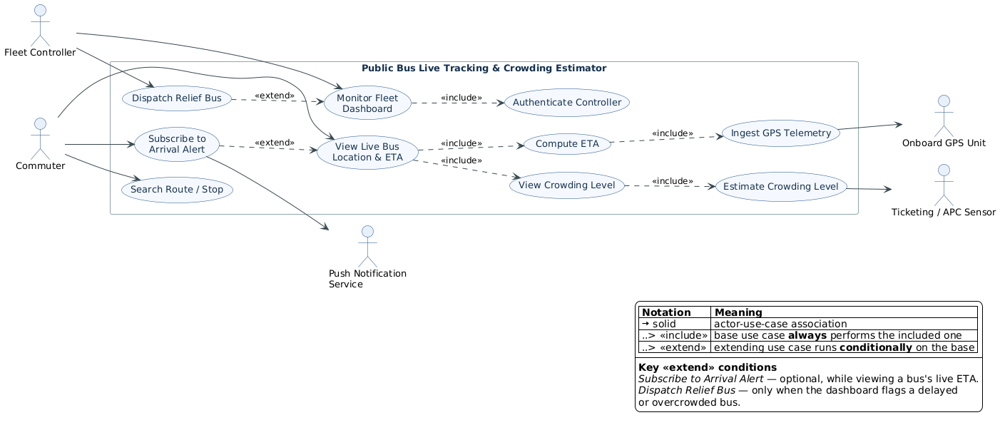

# Lab 1 — Requirements Engineering & UML Use-Case Modelling

**PES University — Dept. of CSE**
**Problem Statement #24:** Public Bus Live Tracking & Crowding Estimator
**Primary Domain:** Smart Cities, Transport & Logistics
**Actors:** Commuter, Fleet Controller
**SRN:** PES1UG24CS392

---

## Problem Context

A municipal transit intelligence platform that ingests GPS feeds from city buses, estimates arrival times (ETA) at downstream stops, and computes passenger crowding levels from ticketing sensors.

---

## Deliverables

| # | Deliverable | File |
|---|---|---|
| 1 | Complete Requirements Table — 5 FRs + 2 NFRs with ID, Type, Description, Priority, Acceptance Criteria, Rationale | [`01_Requirements_Table.md`](01_Requirements_Table.md) |
| 2 | UML Use-Case Diagram — all actors, primary use cases, «include» and «extend» relationships | [`02_UseCase_Diagram.png`](02_UseCase_Diagram.png) · source: [`02_UseCase_Diagram.puml`](02_UseCase_Diagram.puml) |
| 3 | Use-Case Flow Specification — UC-02 *View Live Bus Location & ETA*, with preconditions, postconditions, main success scenario and one alternate flow | [`03_UseCase_Flow_Specification.md`](03_UseCase_Flow_Specification.md) |

---

## Use-Case Diagram



### Actors modelled

| Actor | Kind | Role |
|---|---|---|
| Commuter | Primary (human) | Searches routes/stops, views live ETA and crowding, subscribes to arrival alerts |
| Fleet Controller | Primary (human) | Monitors the fleet dashboard, dispatches relief buses |
| Onboard GPS Unit | Secondary (system) | Supplies the 5-second position telemetry stream |
| Ticketing / APC Sensor | Secondary (system) | Supplies boarding/alighting counts for crowding estimation |
| Push Notification Service | Secondary (system) | Delivers arrival alerts to the commuter's device |

### Relationships

**«include»** (base use case always performs the included one)

- `View Live Bus Location & ETA` → `Compute ETA`
- `View Live Bus Location & ETA` → `View Crowding Level`
- `Monitor Fleet Dashboard` → `Authenticate Controller`
- `Compute ETA` → `Ingest GPS Telemetry`
- `View Crowding Level` → `Estimate Crowding Level`

**«extend»** (extending use case runs conditionally on the base)

- `Subscribe to Arrival Alert` ⇢ `View Live Bus Location & ETA` — optional, while viewing a bus's live ETA
- `Dispatch Relief Bus` ⇢ `Monitor Fleet Dashboard` — only when the dashboard flags a delayed or overcrowded bus

---

## Regenerating the diagram

The diagram is authored in PlantUML. To re-render after editing the source:

```bash
java -jar plantuml.jar -tpng 02_UseCase_Diagram.puml
```
